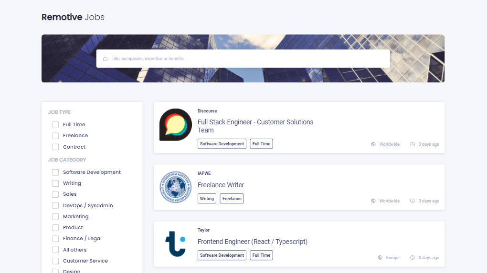
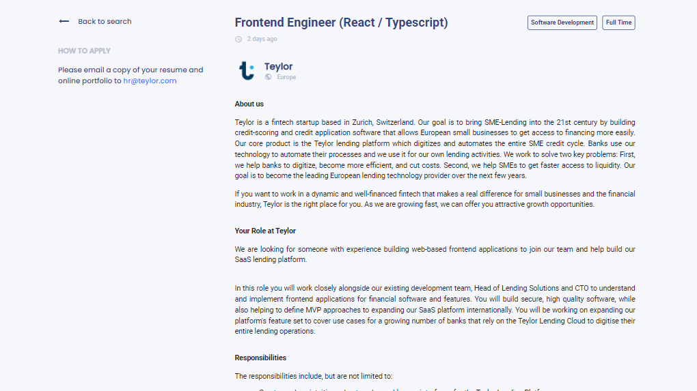
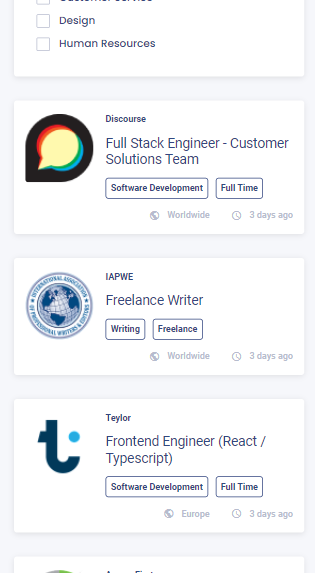

<h1 align="center">Jobs App</h1>

<div align="center">
  <h3>
    <a href="https://jobs-vue.vercel.app/">
      Demo
    </a>
  </h3>
</div>

<!-- TABLE OF CONTENTS -->

## Table of Contents

- [Overview](#overview)
  - [Built With](#built-with)
- [Features](#features)
- [How to use](#how-to-use)
- [Contact](#contact)

<!-- OVERVIEW -->

## Overview

<div align="center">




</div>

### Built With
- [Vue.js](https://vuejs.org/)

## Features
- User can see a list of jobs
- User can search for a job
- User can filter jobs by job type or category
- User can do multiple filters simultaneously
- User can see jobs on different pages and move among them using pagination
- User can select a job and see it's details & description


## How To Use

<!-- Example: -->

To clone and run this application, you'll need [Git](https://git-scm.com) and [Node.js](https://nodejs.org/en/download/) (which comes with [npm](http://npmjs.com)) installed on your computer, [Vue-cli](https://cli.vuejs.org/guide/installation.html) From your command line:

```bash
# Install Vue Cli
$ npm install -g @vue/cli

# Clone this repository
$ git clone https://github.com/aoa97/jobs-vue

# Install dependencies
$ npm install

# Run the app
$ npm run dev
```

## Contact

- GitHub [@aoa97](https://github.com/aoa97)
- LinkedIn [@aoa97](https://www.linkedin.com/in/engahmedusama/)
